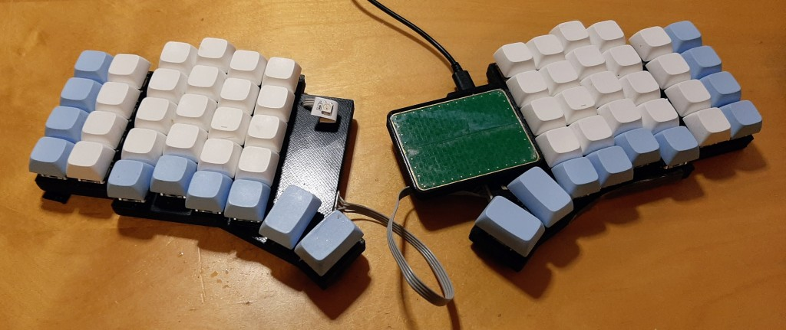
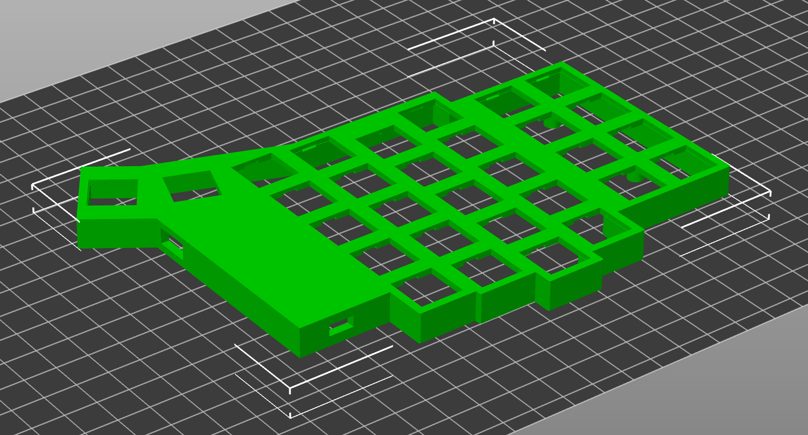
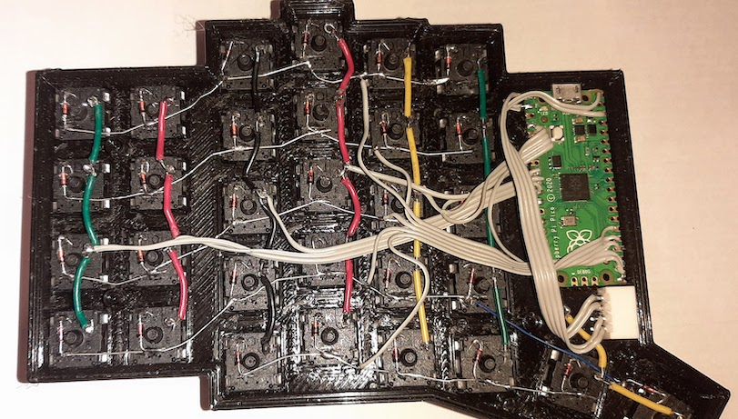
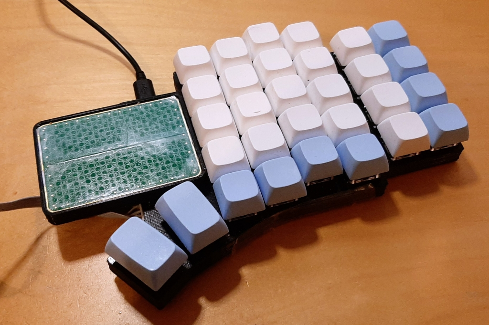

# Eskarp

An ergonomic, column staggered split keyboard with optional touchpad.
Inspired by keyboards such as [Lily58](https://github.com/kata0510/Lily58)
and [Sofle](https://josefadamcik.github.io/SofleKeyboard/).  Uses a 3D
printed case, with handwired MX compatible switches and a [Raspbery Pi
Pico](https://www.raspberrypi.com/products/raspberry-pi-pico/) controller
in each half.  Designed using [Ergogen](https://ergogen.xyz/).

## Firmware

Written in Rust, using [Keyberon](https://github.com/TeXitoi/keyberon) for
matrix scanning, debouncing and USB HID support.  Uses [RTIC](https://rtic.rs/)
runtime and [rp-pico](https://crates.io/crates/rp-pico) for Raspberry Pi Pico
support.

Each half runs the same firmware, with left / right being determined by GPIO 28
pull up/down (low = left, high = right).  Either side can act as the primary
(connected to host USB interface).  Key events from the secondary half (not
connected to USB) are sent to the primary over a serial link.

Firmware update is done on each half by resetting into bootloader mode and
mounting the RP2 mass storage device and copying the firmware build onto it.  To
reset into bootloader mode, press the reset key combo (On layer 3, the outermost
top key) five times.

## Case

The case is designed using Ergogen, version v3.1.2 - online at
<https://ergogen.cache.works/> or local install (<https://docs.ergogen.xyz/>).
See [`case/Makefile`](case/Makefile) for build commands.  Generated SVG and STL
files for the case are included in [`case/svg`](case/svg) and
[`case/stl`](case/stl).  The left and right halves are identical and should be
mirrored when slicing for 3D printing.Gcode for an Ender 3 printer with 0.8mm
nozzle is included in [`case/gcode`](case/gcode).

The keyboard matrix is handwired with RP PICO GPIOs 16-20 used for rows and
GPIOs 2-8 for the columns.  The thumb keys are both on the same column, with the
outermost on row 3 and the innermost on row 4.

Communication between the halves is via a serial link using 4 pin JST-XH
connectors.  The cable has a cross-over for RX and TX, so each half has the same
pin assingment:

1. TX (from RP Pico pin 1)
2. RX (from RP Pico pin 2)
3. Vbus (from RP Pico pin 40)
4. GND (from RP Pico pin 38)

An optional WS2812b LED can be added to indicate the current layer.  This was
added after the case was designed and printed, so a hole was drilled into the
top for the wires to the LED.

## Touchpad

An optional touchpad can be fitted to the case, using the TPS65-201A-S from
Azoteq.  This will appear as a USB HID mouse to the host computer.

The touchpad sits in a 3D printed holder and is wired to the RP Pico pins
as:

* 10: RDY
* 11: RST
* 12: SDA
* 13: SCL
* 36: VDD (3.3V)
* 38: GND

It can be fitted to either side - the firmware will detect the presence of
the touchpad - but must be on the same side as the USB connection to the
host computer (the mouse reports are not sent over the serial link to the
other half of the keyboard).

## BOM

* 3D printed case top - left and right
* 3D printed case lid - left and right
* 60x MX style switches
* 60x 1N4148 diodes
* wire
* 60x keycaps
* 8x No2 gauge, 1/4" screws
* 2x Raspberry PI Pico
* 2x JST-XH 4 pin sockets
* 2x JST-XH 4 pin plugs
* 4 wire cable
* (Optional) 1x WS2812b compatible LED
* (Optional) TPS65-201A-S available from Digikey or Mouser
